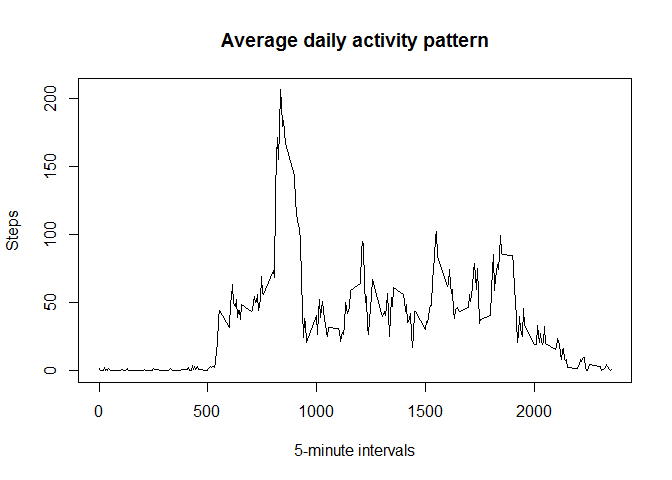

# Reproducible Research: Peer Assessment 1


## Loading and preprocessing the data

```r
library(dplyr)
```


```r
if (!file.exists("data/activity.csv")) {
    unzip("activity.zip", exdir = "data")    
}
data <- read.csv("data/activity.csv")
datadt <- tbl_df(data)
```

## What is mean total number of steps taken per day?

```r
print(paste("Steps mean: ", mean(data$step, na.rm = TRUE)))
```

```
## [1] "Steps mean:  37.3825995807128"
```

```r
print(paste("Steps median: ", median(data$step, na.rm = TRUE)))
```

```
## [1] "Steps median:  0"
```

## What is the average daily activity pattern?


```r
averagedData <- summarise(group_by(datadt, interval), steps = mean(steps, na.rm = TRUE))
plot(x = averagedData$interval, y = averagedData$steps, type = "l", xlab="5-minute intervals", ylab="Steps", main="Average daily activity pattern")
```

 

```r
maximumAveInterval <- averagedData[order(averagedData$steps, decreasing = TRUE), ][[1, "interval"]]
```

**Maximum steps interval is: 835**


## Imputing missing values


```r
# 1. Missing vals
missingRows <- filter(datadt, is.na(steps) | is.na(date) | is.na(interval))
missingRowsCount <- count(missingRows)$n
```

* Missing rows: 2304

## Are there differences in activity patterns between weekdays and weekends?


I was very tired and didn't finished the rest.
