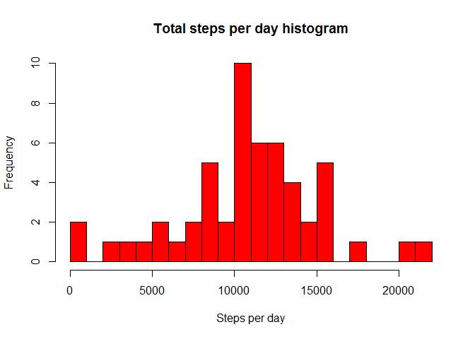
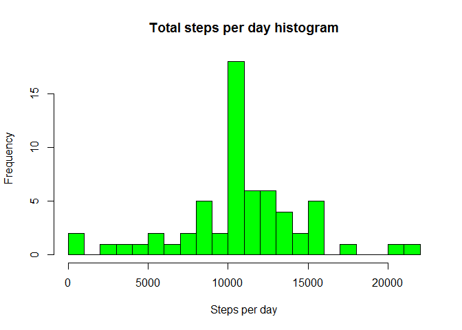

# Reproducible Research: Peer Assessment 1

## Important note!

**Please be patient to other peoples works. This assignment can invoke disputes. So please be generous.**


## Loading and preprocessing the data
First off, we load the required libraries for data manipulation and plotting


```r
library(dplyr)
library(ggplot2)
```

Next, check whether the csv file exists or not, and unzip. After that load data and cast column types to required ones.


```r
if (!file.exists("data/activity.csv")) {
    unzip("activity.zip", exdir = "data")    
}
data <- read.csv("data/activity.csv")
datadt <- tbl_df(data)
datadt$date <- as.Date(datadt$date)
datadt$steps <- as.numeric(datadt$steps)
datadt$interval <- as.numeric(datadt$interval)
```


## What is mean total number of steps taken per day?

Here we draw a **histogram**, that is the frequencies of total steps per day. This plot (and the third one) causes the most difficulties among different people.


```r
grouppedByDate <- group_by(datadt, date)
# Do nopt include NA values
stepsByDate <- summarise(grouppedByDate, steps = sum(steps, na.rm = TRUE))
hist(stepsByDate$steps, breaks = 20, col = "red", xlab = "Steps per day", main = "Total steps per day histogram")
```

 

```r
# Also exclude NA
print(paste("Steps mean: ", mean(stepsByDate$steps, na.rm = TRUE)))
```

```
## [1] "Steps mean:  9354.22950819672"
```

```r
print(paste("Steps median: ", median(stepsByDate$steps, na.rm = TRUE)))
```

```
## [1] "Steps median:  10395"
```


## What is the average daily activity pattern?


```r
averagedData <- summarise(group_by(datadt, interval), steps = mean(steps, na.rm = TRUE))
plot(x = averagedData$interval, y = averagedData$steps, type = "l", xlab="5-minute intervals", ylab="Steps", main="Average daily activity pattern")
```

 

```r
maximumAveInterval <- averagedData[order(averagedData$steps, decreasing = TRUE), ][[1, "interval"]]
```


**Maximum steps interval is: 835**


## Imputing missing values

We use the following strategy to fill empty values: fill it with a mean value for a given interval. Mean values per interval we calculated before and stored in the **averagedData** variable. This strategy is stored in a **fixSteps()** function and is used then to refill the steps column with calculated data.


```r
# 1. Missing vals
missingRows <- filter(datadt, is.na(steps))
print(paste("Missing rows: ", count(missingRows)$n))
```

```
## [1] "Missing rows:  2304"
```

```r
# 2. Devise a stratagy for filling NA steps
fixSteps <- function (steps, interv) { 
    if (is.na(steps)) { 
        round(filter(averagedData, interval == interv)$steps)
    } else { 
        steps 
    }  
};

# 3. Fill the missing values
filledDatadt <- 
    tbl_dt(datadt) %>% 
    rowwise() %>% 
    mutate(steps = fixSteps(steps, interval))
```

```
## Loading required namespace: data.table
```

```r
# 4. Make a histogram and calculate means
grouppedByDate <- group_by(filledDatadt, date)
stepsByDate <- summarise(grouppedByDate, steps = sum(steps))
hist(stepsByDate$steps, breaks = 20,col="green", xlab = "Steps per day", main = "Total steps per day histogram")
```

 

```r
print(paste("Steps mean: ", mean(stepsByDate$steps)))
```

```
## [1] "Steps mean:  10765.6393442623"
```

```r
print(paste("Steps median: ", median(stepsByDate$steps)))
```

```
## [1] "Steps median:  10762"
```

**Wee can see that imputing the NA values lead to increasing the mean and median.**


## Are there differences in activity patterns between weekdays and weekends?

Here we just separate the data by **dayType** factor and render a separate plots for different factor values.
The usage of **Sys.setlocale()** is mandatory for non-english-speaking countries, because R has a localized weekday names.


```r
# Function to mark day type for rows
Sys.setlocale("LC_TIME", "English")
```

```
## [1] "English_United States.1252"
```

```r
mark.weekday <- function (rowDate) {
    dayName <- weekdays(rowDate)
    if (dayName == "Sat" || dayName == "Sun") { "weekend" } else { "weekday" }
}

# Add new field
filledDatadt <- 
    filledDatadt %>% 
    rowwise() %>% 
    mutate(dayType = mark.weekday(date))


filledDatadt$dayType <- factor(filledDatadt$dayType)

# Draw a plot
averagedData <- summarise(group_by(filledDatadt, dayType, interval), steps = mean(steps, na.rm = TRUE))
qplot(x = averagedData$interval, y = averagedData$steps, xlab="5-minute intervals", ylab="Steps", main="Average daily activity pattern",geom = "path", data = averagedData, facets =  dayType ~ ., color=dayType)
```

 

## Thanks for reviewing my work!

